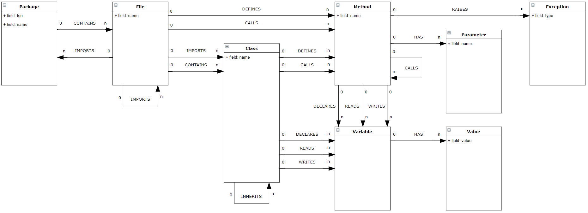

# jqa-python-plugin
jQAssistant Plugin for Python


## Getting Started

Download the jQAssistant command line tool for your system: [jQAssistant - Get Started](https://jqassistant.org/get-started/).

Next download the latest version from the release tab. Put the `jqa-python-plugin-*.jar` into the plugins folder of the jQAssistant command
 line tool.

```bash
jqassistant-commandline-neo4jv3-1.6.0/bin/jqassistant.sh scan -f <file or directory path>
```

You can then start a local Neo4j server to start querying the database at [http://localhost:7474](http://localhost:7474):

```bash
jqassistant-commandline-neo4jv3-1.6.0/bin/jqassistant.sh server
```

## Build
Requirements:
* Java 8 
* Maven
```bash
git clone https://github.com/softvis-research/jqa-python-plugin
cd jqa-python-plugin
mvn clean install
```

## Model


